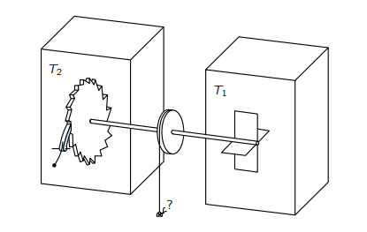
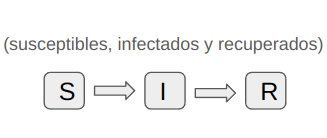

# Modeling-in-Nature-Science

## Prologo

## Introduction

## Fundamento teorico

### Procesos de Markov

### Ecuaciòn de Langevin, Focker-Planck

### Motor Browniano

$$m\dot{x} = -\frac{dV}{dx} +\frac{1}{m\gamma}F + \sqrt{2D}\xi(t)$$
$$V:\text{Potential ratchet}$$

### Modelos epidemicos

SIR model:
$$Prob\{\Delta S (t)=i,\Delta I(t)=j|(S(t),I(t))\}=
	\begin{cases}
		\frac{\beta}{N} S(t)I(t)\Delta t+o(\Delta t),&(i,j)=(-1,1)(infección)\\
		\gamma I(t)\Delta + o(\Delta t),&(i,j)=(0,-1)(recuperación)\\
		1-\Big[ \frac{\beta}{N}S(t)I(t)+\gamma I(t) \Big]\Delta t,&(i,j)=(0,0)\\
		o(\Delta t),& otherwise 	
	\end{cases}$$

### Crecimiento celular -> cambiar a un proceso geologico/geophsyico/climatico/etc

## Conclusiones

## Resultados